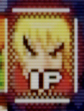
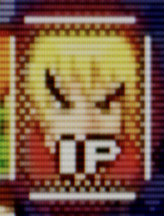
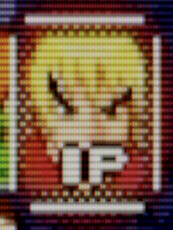

# MiM-RetroArch

RetroArch shaders designed for pi4+.  They're gles 2 compatible via mangling, so there is a [WebGL 2 demo](https://adrianmarkperez.github.io/MiM-RetroArch/crt-demo.html) available.

## `MiM-CRT` Shader

The goal was to create something that maintained framerate and approached the quality of shaders targeting desktop GPUs like e.g. `crt-royale` (twelve passes) or `crt-guest-dr-venom` (ten passes).

### Examples

| Example Subregion | Notes |
| --- | --- |
|  | HD resolution (720p). |
|  | FHD resolution (1080p). |
|  | QHD resolution (1440p). |
|  | UHD resolution (2160p). |
|  | 8k resolution (4320p). |

### Description

`MiM-CRT` uses up to four passes:

#### Prep Pass

Corrects for the input gamma and stores luminance history in the alpha channel.  

The alpha term is used in the last pass to approximate halation (caused by phosphors remaining lit for a time after being hit by the beam).  The Halation Power defines how quickly old luminance fades away.  Old sets from the 80's had a _lot_ of halation.

#### Blur Pass

A configurable gaussian blur is performed with two passes (9x9, performing 5 texture samples each) or one pass (3x3, performing 9 samples).  

The result of these blur passes is used to approximate diffusion (caused by light bouncing around as it travels between the lit phosphor and the CRT surface).

`MiM-CRT-2pass` skips blur entirely. 

#### Resolve Pass

The Phorphor term is computed by per-phosphor signed distance field, to minimize aliasing. It samples the result of pass 0 four times.

The Diffusion term is a sampling of the possibly blurred texture.

There are separate curve and correction parameters for Phosphor and Diffusion, to support a range of glass thickness,

## Appendix A: Overclocking the pi4 GPU

Gentle overclocking for the GPU helps keep visual stuttering (when the GPU isn't able to finish its frames in time).  This can be accomplished by modifying `/boot/config.txt`:

```
# Turn up GPU (+ core freq, for the memory used by the GPU) to 750 Mhz
arm_boost=1
v3d_freq=750
core_freq=750
```
